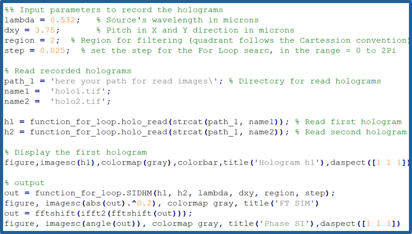

# Generalized computational framework for Structured Illumination Digital Holography
The use of a structured illumination (SI) pattern to illuminate a target complex object in digital holographic microscopy (DHM) allows for encoding high spatial frequencies of the target microscopic sample into the +1 diffraction term, reconstructing super-resolved phase images after the proper computational reconstruction. The accuracy of these phase maps depends on the correct demodulation of the high-resolution frequencies within the +1 term and the proper compensation of the interference angle between the object and reference waves of the DHM system. This work presents a generalized reconstruction framework for SI-DHM that automatically demodulates the two laterally-shifted object spectrums and compensates for the linear phase term of the optical interference with minimum input from the user (i.e., two recorded holograms with a phase shift of the SI pattern, the source’s wavelength and the pixel size of the sensor). 

## Generalized SI-DHM framework 
The block diagram of the generalized SI-DHM framework contains six stages. The first stage is focused on definiting the input parameters, which are the two recorded holograms (hi), the source wavelength (), and the pixel size of the sensor (xy). The second one is focused on estimating the Fourier spectra of the recorded holograms (Hi). The third one corresponds to the spatial filtering of the hologram spectrum to select the +1 term (H+1,i). The fourth and fifth steps are the demodulation of the laterally-shifted object spectrum encoded in the +1 term (i.e., Gplus and Gminus) and its proper centering in the frequency domain, respectively. Finally, the last step is the combination of both centered object spectra to generate the super-resolved phase image.

## Methods of use
We have developed two implementations of the proposed generalized SI-DHM framework. One version minimizes the cost functions using iterative loops, while the other uses a heuristic approach. Both implementations are available for download in MATLAB and Python

<table>
    <thead>
        <tr>
            <th></th>
            <th>Iterative loop</th>
            <th>Heuristic approach</th>
        </tr>
    </thead>
    <tbody>
        <tr>
            <td><b>Matlab</b></td>
            <td><a href="https://drive.google.com/drive/folders/1Oz5mtYSKc5vJz513uIfBq5hGq6Ps58xu?usp=sharing" download>Click to download</a></td>
            <td>Click to Download</td>
        </tr>
        <tr>
            <td><b>Python</b></td>
            <td><a href="https://drive.google.com/drive/folders/18gG1earq-w9dI_Nl5ZCrUP7y6cUk4riR?usp=drive_link" download>Click to download</a></td>
            <td><a href="https://drive.google.com/drive/folders/18gG1earq-w9dI_Nl5ZCrUP7y6cUk4riR?usp=drive_link" download>Click to download</a></td>
        </tr>
    </tbody>
</table>

## Download Samples
<a href="/Samples/start">Test Start</a> 
Parameter: wavelength 632.8 nm and pixel size 3.75 um

<a href="/Samples/USAF">Test USAF</a> 
Parameters: wavelength 532 nm and pixel size 3.75 um

## Example of Matlab
|  |
|------------------------------------------------------|

## Funding
This project was funded by Vicerrectoría de Ciencia, Tecnología e Innovacion, the Fundamental Sciences area at Universidad EAFIT, and the National Science Foundation (NSF) (grant number 2042563 and 2404769).

## Credits
-	MATLAB (2020). version 7.10.0 (R2020a). Natick, Massachusetts: The MathWorks Inc.
*	Python Software Foundation. 

## Citation
If using the generalized SI-DHM framework for publication, please kindly cite the following: S. Obando-Vasquez, R. Castaneda, R. Restrepo, C. Trujilo, and A. Doblas, “Generalized computational framework for phase image reconstruction in structured illumination digital holographic microscopy,” Optics Express, under review (2024). 

## Support or Contact
The Principal Investigators (PIs) of the project are Drs. Carlos Trujillo, and Ana Doblas

